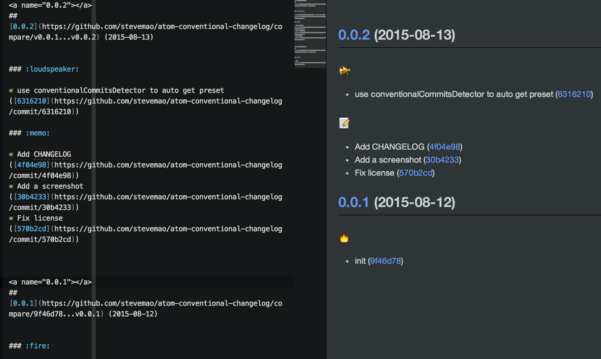

# Atom conventional-changelog package

> Generate a changelog or make a new GitHub release from git metadata.



## Install

```
$ apm install conventional-changelog
```

Or Settings → Install → Search for `conventional-changelog`


## License

MIT © [Steve Mao](https://github.com/stevemao)
